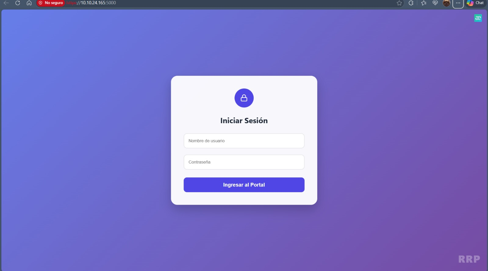
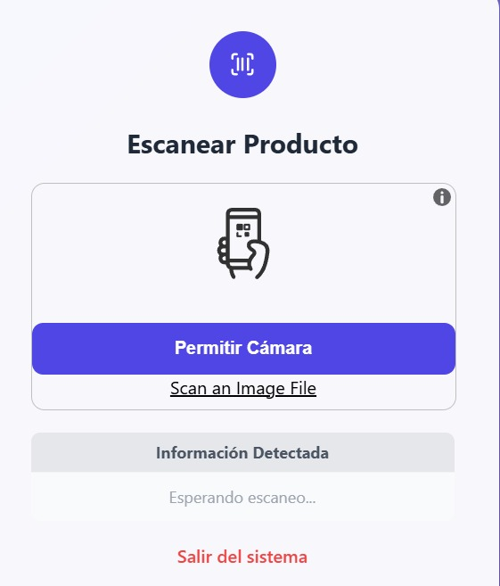
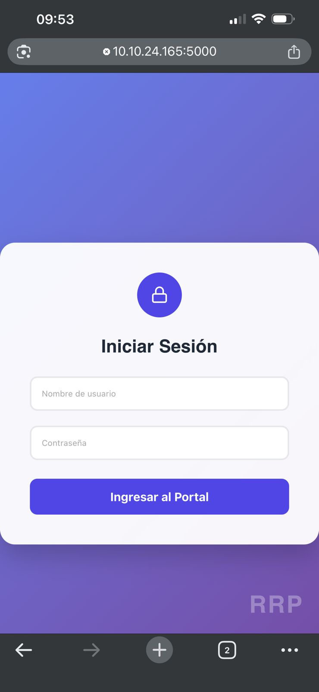
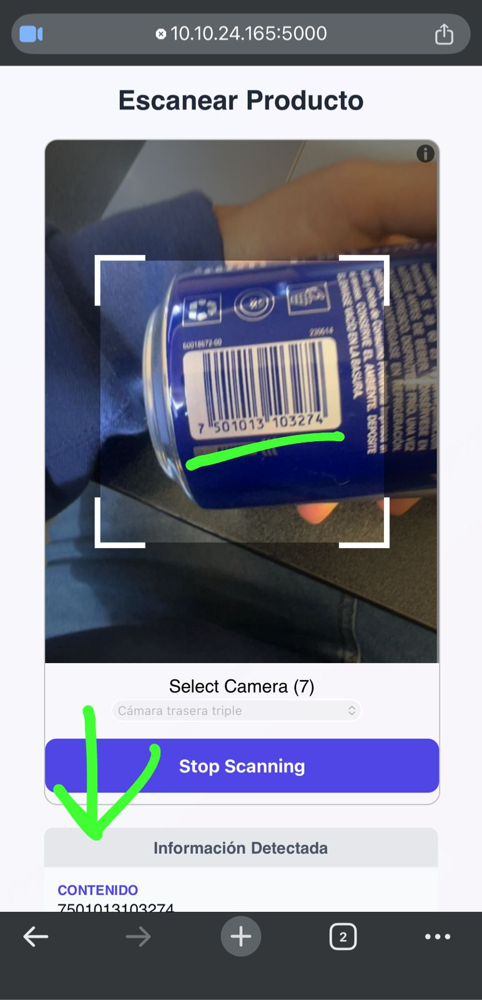
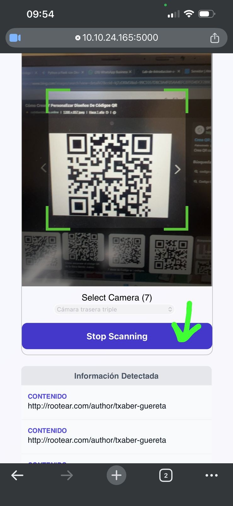

Primero aquí se importa flask y varias herramientas necesarias para manejar la aplicación web, como HTML y más, después se crea la aplicación con Flask y se define una clave secreta que sirve para manejar las sesiones, o sea para saber si el usuario ha iniciado sesión. Luego se definen las credenciales correctas, que en este caso son un usuario y una contraseña específicos que se van a usar para validar el acceso.

Posteriormente se crea una variable muy grande donde se guarda todo el código html de la interfaz, ahí se incluye tanto el diseño como los estilos y scripts, o sea toda la página completa, dentro de ese html se usa una condición para mostrar dos cosas diferentes, si el usuario ya inició sesión se muestra la pantalla para escanear códigos, y si no se muestra el formulario de inicio de sesión, también dentro del html hay javascript (que sirve para activar la cámara y escanear códigos qr usando una librería externa).

Se definen varias rutas para validar los datos y mostrarlos en la pantalla, de tal manera que cumple con su función el programa. Además se incluye una ruta para cerrar sesión que lo que hace es limpiar la sesión y redirigir al inicio y finalmente se ejecuta la aplicación donde la terminal da una dirección local para correr eso y desde esa dirección también puedes abrirlo en el celular gracias a la última línea de código "ssl_context"

Funcionando se ve así:
Este es el login visto desde la computadora

Este es el escaneo visto desde la computadora

Este es el login visto desde el celular

Este es el escaneo visto desde el celular

Este es el escaneo del QR visto desde el celular

